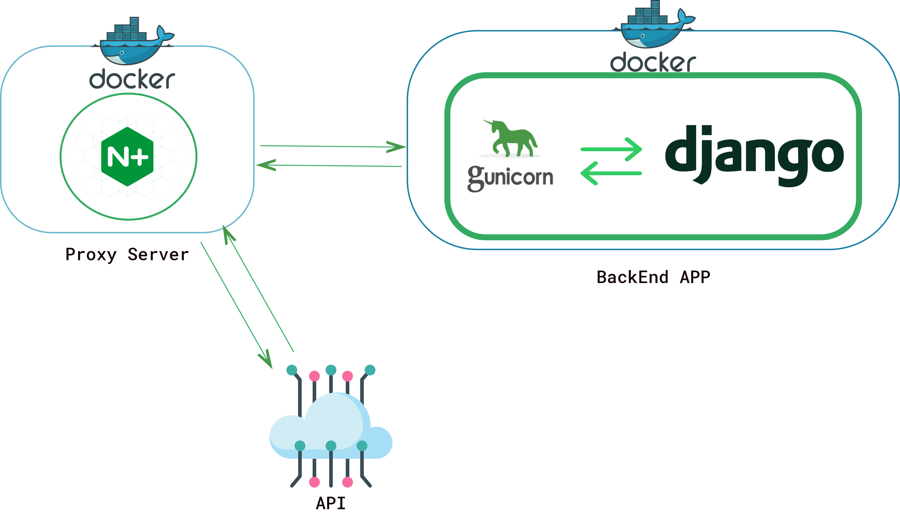

# Build a Django Rest API to serve an end-to-end speech synthesizer and deploy a production-ready  version leveraging Docker, Gunicorn and Nginx

## Install and run the project

- You need [docker-engine](https://docs.docker.com/engine/install/) and [docker-compose](https://docs.docker.com/compose/install/)
- Build the project with the following command: `docker-compose up --build`
- Start listening on port 8080

### Requirements

- Docker, Docker-Compose
- Nvidia Cuda Capable GPU, [Cuda drivers](https://docs.nvidia.com/cuda/cuda-installation-guide-linux/index.html) setup
- [Nvidia-docker toolkit](https://github.com/NVIDIA/nvidia-docker) installed

## Test the API with postman

- install [postam](https://www.postman.com/), start requesting on port 8080 with the following url: `http://localhost:8080/tts/`
- provide an audio (wav format monochannel recorded)  file for the `POST` method.
- ENJOY!! :blush:

## Medium article to follow along

- Medium tutorial for an indepth review of the application: [medium post](https://aymanehachchaming.medium.com/an-architecture-for-production-ready-natural-speech-synthesizer-8d0870b76cba)

## Contact me

### Aymane Hachcham

- **email**: aymanehachchaming@gmail.com
- **Linkedin**: [linkedin](https://www.linkedin.com/in/aymane-hachcham/)
- **other repos**: [github-repos](https://github.com/aymanehachcham?tab=repositories)
